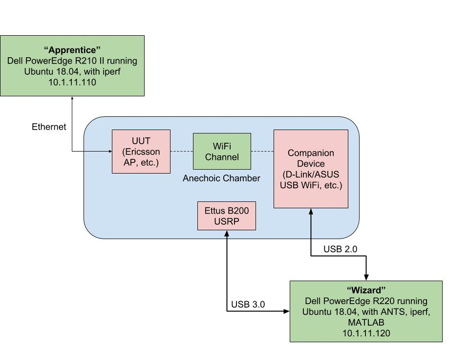

# ANTS

ANTS, the Automated Networking Test Suite, is a tool designed to streamline the analysis of compliance of commercial WiFi networking devices to the IEEE 802.11 standard. The metric for this compliance output is developed by Ammar Alhosainy *et al.* at Carleton University, in parternship with Ericsson's Ottawa and international offices. The purpose of the ANTS tool is to simplify this process by providing an easy-to-use graphical interface for configuring and running tests against these devices. In order to maximize its accessibility, ANTS continues to be designed exclusively with open-source and freely-available software, particularly that which is available on modern Linux operating systems.

**Note**: This project is under active development, and a stable release branch has not yet been established.
The ```master``` branch is where the most stable version can be found, but interface and functionality contained therein are not yet guaranteed to be consistent or fully operational.

## Hardware Requirements

The following is a list of essential components for using ANTS in its current form:

* One or more wireless networking devices, known as the Unit(s) Under Test (UUTs) with USB and/or Gigabit Ethernet LAN connectivity
* One or two modern computers with USB 3.0 and Gigabit Ethernet ports (see [Installation and Test Setup](## Installation and Test Setup) for the single-machine method)
* A software-defined radio capable of transmitting and receiving on the same wireless bands as the UUTs

ANTS was originally developed and tested using the [Ettus Research B200](https://www.ettus.com/product/details/UB200-KIT) software-defined radio device, which is the core measurement tool that senses the wireless channel and collects the data for further processing. No other devices are currently supported (although additional devices are on the roadmap). The (UUT) in a typical test setup is a either a commercially-available USB WiFi device, or a wireless router.

Below is a diagram showing an example test setup previously used at the Carleton Broadband Networks Laboratory:



## Software Requirements

ANTS was written and tested on systems running Fedora 28 and Ubuntu 16.04, but it should work on any modern Linux operating system with the following installed:

* Python 3 (written and tested on 3.6.5 and later 3.7.x)
* PyQt5
* gnuradio (for the core writeIQ script)

Additionally, one script (```utils/writeIQ.py```) is currently written in Python 2, but will be updated as part of the project goals.

Early versions of the tool relied upon the use of the [MATLAB Engine for Python](https://www.mathworks.com/help/matlab/matlab-engine-for-python.html); however a significant effort was undertaken by the members of the Carleton University Broadband Networks Laboratory to rewrite the prototypical scripts in Python 3. Copies of the original MATLAB code are contained in the ```matlab``` folder for reference.

## Installation and Test Setup

1. ```pip3 install pyqt5```
2. ```sudo apt install gnuradio``` (Ubuntu) or ```sudo dnf install gnuradio``` (Fedora)
3. From the home directory (or wherever you want to store your copy of the project), ```git clone https://github.com/threexc/ANTS```
4. Set ```install.sh``` executable with `chmod +x install.sh` then run `sudo ./install.sh`;
5. (Optional) If running the test from a single machine, run the ```utils/setup_routing.py``` script to configure network interfaces and routing appropriately;
6. Run ANTS by typing ```ants``` from anywhere on the system;
7. Set test parameters and press "Run";
8. Collect the results.

## Test Outputs

By default, ANTS will provide six outputs in a time-stamped folder matching the name of the test given by the user and the access category (i.e. "voice", "video", "best effort", or "background"). These files are:

1. A histogram detailing the interframe spacing of the measured data packets;
2. A second histogram showing the transmission opportunity durations measured by the software-defined radio;
3. A third histogram showing the compliance thresholds of the data via bin probabilities;
4. A plot of the raw signal data (currently non-interactive, used mainly to verify that the wireless medium is appropriately saturated);
5. A text file containing the resultant statistics of the collected data;
6. The raw data file with the extension ```.bin```.


## To-Do List

* Increase test customization by enabling more parameters for the software-defined radio and ```iperf``` to be set via the GUI;
* Support more complete networking configuration from inside the GUI;
* Add the ability to automate and provide an aggregate of the compliance results from multiple test runs;
* Build an alternative command-line interface for scripting tests;
* Add support for additional software-defined radios and other testing devices;
* Provide interactive documentation in the form of descriptive tool-tips in the GUI;
* Increase comment completeness in the code;
* Windows support (low-priority right now).

## Authors

* **Trevor Gamblin** - [threexc](https://github.com/threexc) - Primary developer and project manager
* **Ammar Alhosainy** - Original MATLAB scripts and some Python tools
* **Kareem Attiah** - Original MATLAB scripts and some Python tools
* **Shady Elkamhawy** - Initial MATLAB-to-Python script conversion
* **Ahmad Al-Talabi** - Initial MATLAB-to-Python script conversion
* **Xinrui Zhang** - GUI and functional enhancements
